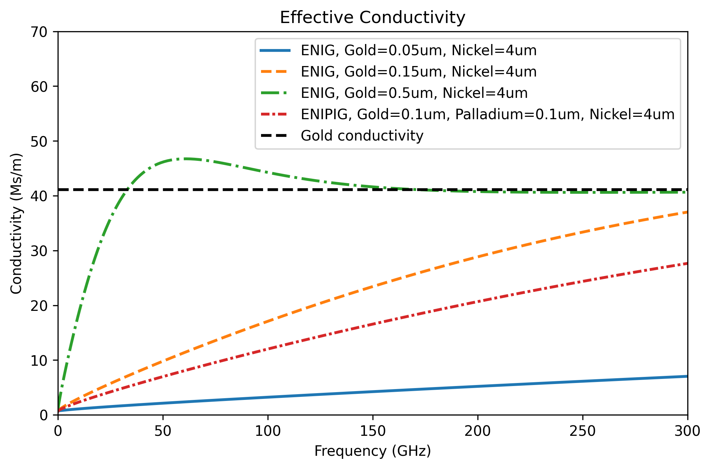
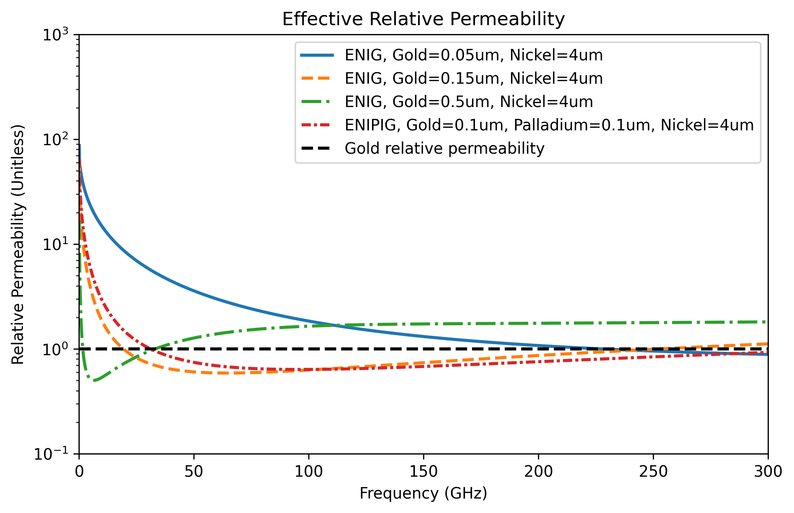

# Surface Impedance

Computing the surface impedance of a conductor (or any material, in fact) while taking roughness into account.

## Implementation

I included the original Gradient Model from the paper [1] for computing the surface impedance of rough material boundary. I never was able to implement a reliable implementation for this method, however the method in [2] computes the surface impedance based on transmission line taper approach is significantly much faster and more reliable than the Gradient Model.

From [3] I included the capability to include multiple layered materials. Additionally, different probability distributions for roughness are included: Normal, Rayleigh, and Uniform. You can add more distributions.

In the implementation of method [2], I modified the code such that you can also taper permittivity and permeability based on the selected CDF.

Some notes to keep in mind:

- The ODE solver for the Gradient Model [1] can be unstable, especially for low roughness values, and is generally slow. Always use method [2] instead.
- In method [1], the bulk conductivity can be frequency-dependent, whereas in method [2], all parameters can be frequency-dependent.

## Installation

You need the following libraries: [SciPy](https://scipy.org/), [NumPy](https://numpy.org/), and [Matplotlib](https://matplotlib.org/) (just for the examples)

## How to Use

I recommend using the transmission line approach, which I implemented in the script [`surfz.py`](https://github.com/ZiadHatab/rough-surface-impedance/blob/main/surfz.py). You only need to have it in the same folder as your main script and load it through import. See included examples for details.

```Python
<<<<<<< HEAD
import numpy as np
import surfz # Should be in same folder as this script
=======
# Should be in same folder as this script
import surfz 
>>>>>>> 6326f8df92e18ad9ca329a9d9e9353c6fbca5b8d

# frequency grid
f = np.logspace(-1, 2, 100)*1e9

# definition of the material (can be more complex and frequency-dependent. See examples!)
material_properties = [{'sigma': 0}, {'sigma': 58e6}]
Rrms = 1e-6
Zs_rough = surfz.surface_impedance(f, material_properties Rrms=Rrms, boundary_loc=0, distribution='norm')
```

## B-field Intensity and Surface Impedance

Example plots for the B-field based on Gradient model [1], see example_1.


Comparison between the Gradient model [1] and Transmission line method [2] for calculating the surface impedance:


## Effective Parameters and Probability Distributions

The surface impedance can be rewritten into real-valued parameters: effective conductivity and relative effective permeability, based on the equation:

$$
Z_{s} = \sqrt{\frac{\omega \mu_0}{2\sigma_{eff}}} + j \sqrt{\frac{\omega \mu_0 \mu_{r,eff}}{2\sigma_{0}}}
$$

Keep in mind these are definitions by choice. Sometimes they don't deliver the same physical interpretation as actual conductivity and permeability would.

Plot below shows comparison between different probability distribution functions for the roughness. See example_2.

 | 
:--: | :--:

## Multiple Conductors

Surface impedance can be used to describe multiple stacked conductors. This is valid in electromagnetic simulations when the total thickness of the layered conductors is less than the wavelength. For PCB surface finishes, we are often dealing with thin coatings (typically less than 5um).

A common misconception among RF engineers designing PCBs is that ENIG (gold-nickel) surface finishes are very lossy. Silver is often praised as the lowest-loss option, which is true, but the story doesn't end there. The thickness of the outermost conductor layer is crucial. This is illustrated through measurements in [4].

The plot below compares ENIG with different gold thicknesses and ENIPIG (an alternative to ENIG). As you'll notice, thicker gold layers lead to a closer effective conductivity to gold's intrinsic conductivity. ENIPIG, using palladium, generally performs better than ENIG with a typical 0.05um gold thickness. At low frequencies, you will notice that the effective conductivity drops (its not zero). This is because of the high relative permeability of the Nickel layer. You can run the code while setting relative permeability of Nickel to 1, and you will see the difference.

 | 
:--: | :--:

## References

[1] G. Gold and K. Helmreich, "A Physical Surface Roughness Model and Its Applications," IEEE Transactions on Microwave Theory and Techniques, vol. 65, no. 10, pp. 3720-3732, Oct. 2017, doi: [10.1109/TMTT.2017.2695192](https://doi.org/10.1109/TMTT.2017.2695192).

[2] B. Tegowski, T. Jaschke, A. Sieganschin, and A. F. Jacob, "A Transmission Line Approach for Rough Conductor Surface Impedance Analysis," IEEE Transactions on Microwave Theory and Techniques, vol. 71, no. 2, pp. 471-479, Feb. 2023, doi: [10.1109/TMTT.2022.3206440](https://doi.org/10.1109/TMTT.2022.3206440).

[3] G. Gold and K. Helmreich, "Modeling of transmission lines with multiple coated conductors," 
2016 46th European Microwave Conference (EuMC), London, UK, 2016, pp. 635-638, doi: [10.1109/EuMC.2016.7824423](https://doi.org/10.1109/EuMC.2016.7824423).

[4] B. Schafsteller, M. Schwaemmlein, M. Rosin, G. Ramos, Z. Hatab, M. E. Gadringer, E. Schlaffer, "Investigating the Impact of Final Finishes on the Insertion Loss in As Received and After Aging," IMAPSource Proceedings, vol. 2023, no. Symposium. IMAPS - International Microelectronics Assembly and Packaging Society, Feb. 29, 2024. doi: [10.4071/001c.94519](https://doi.org/10.4071/001c.94519).

## License

[](https://choosealicense.com/licenses/mit/)
