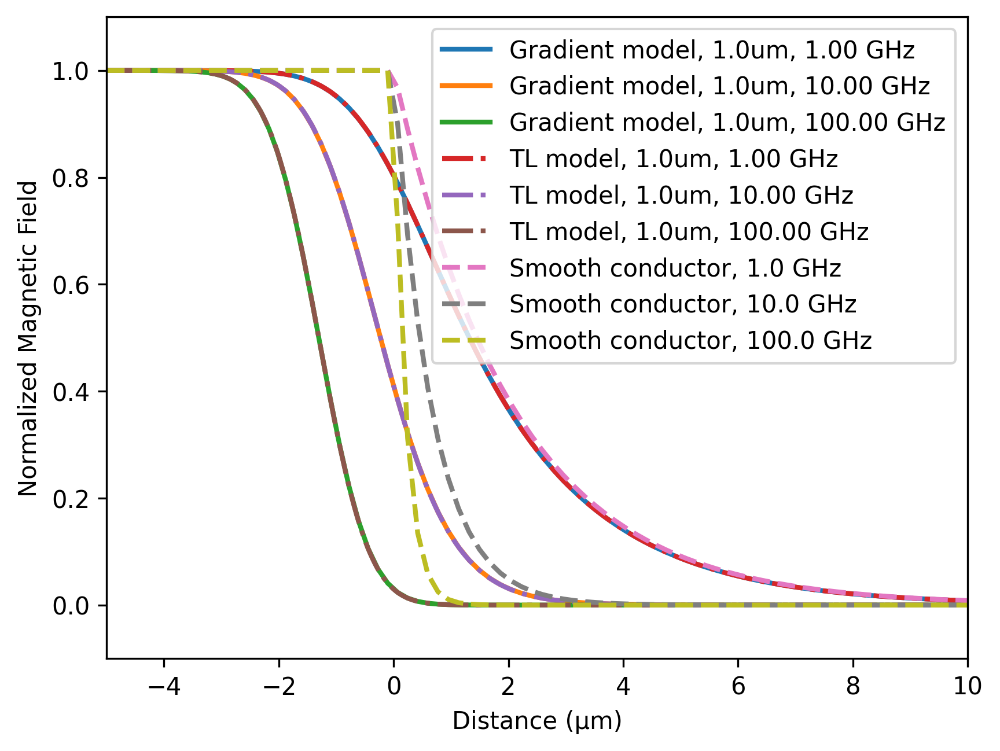
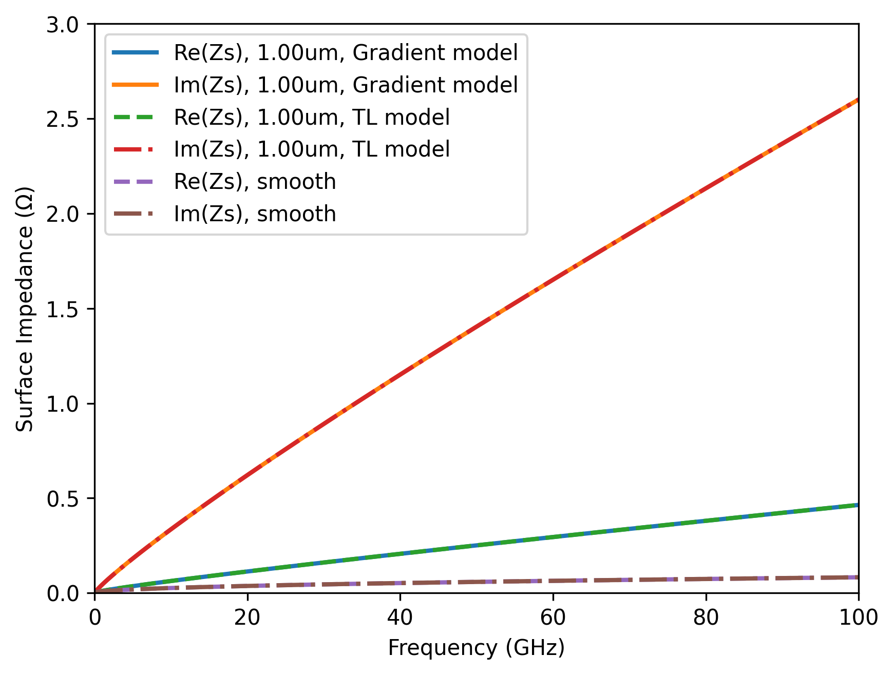
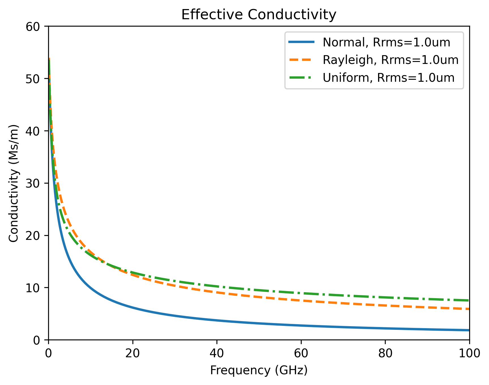
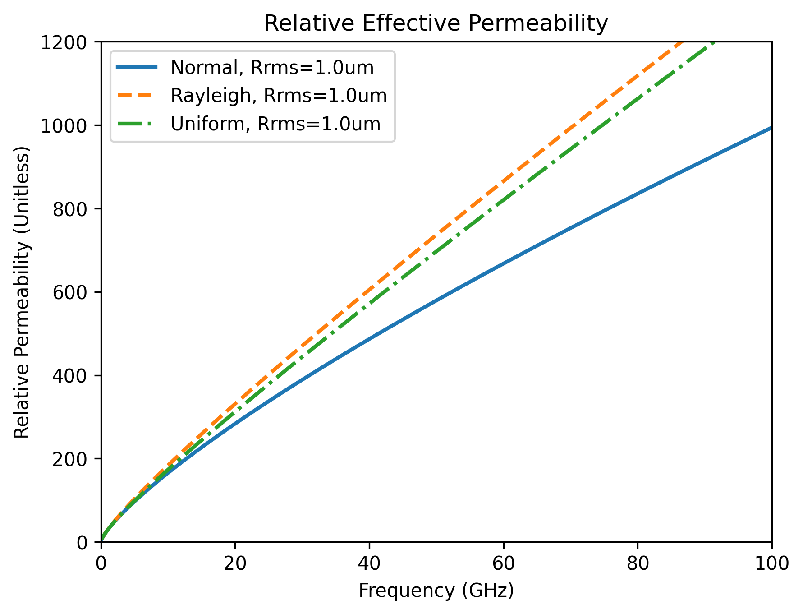
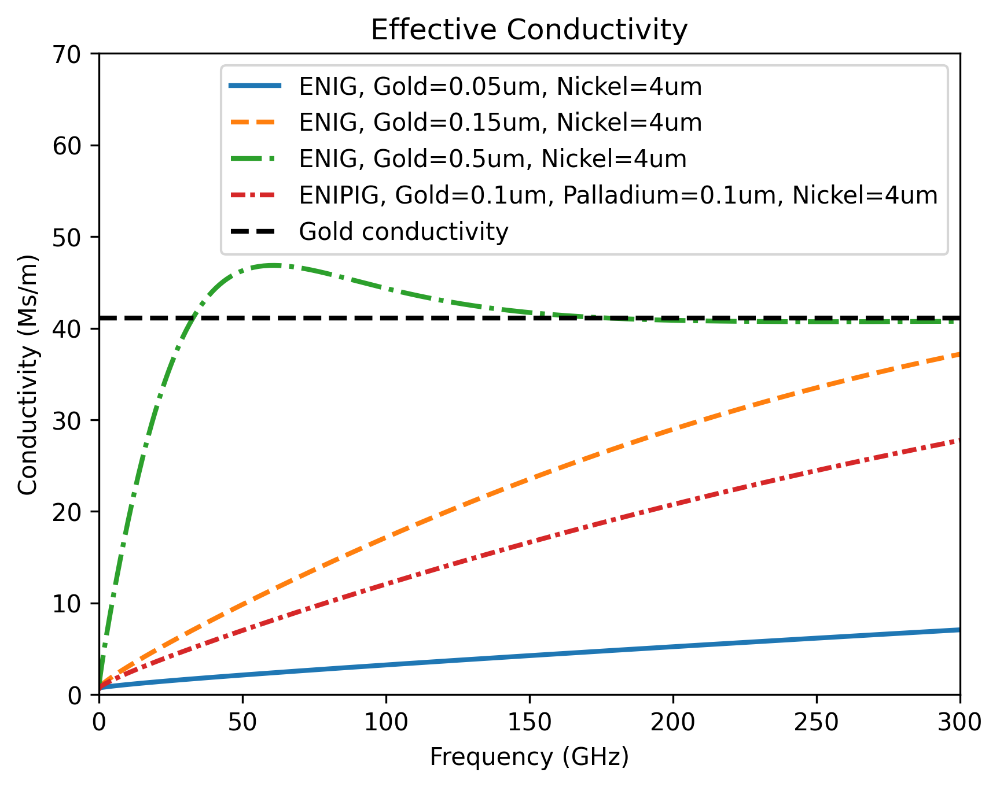
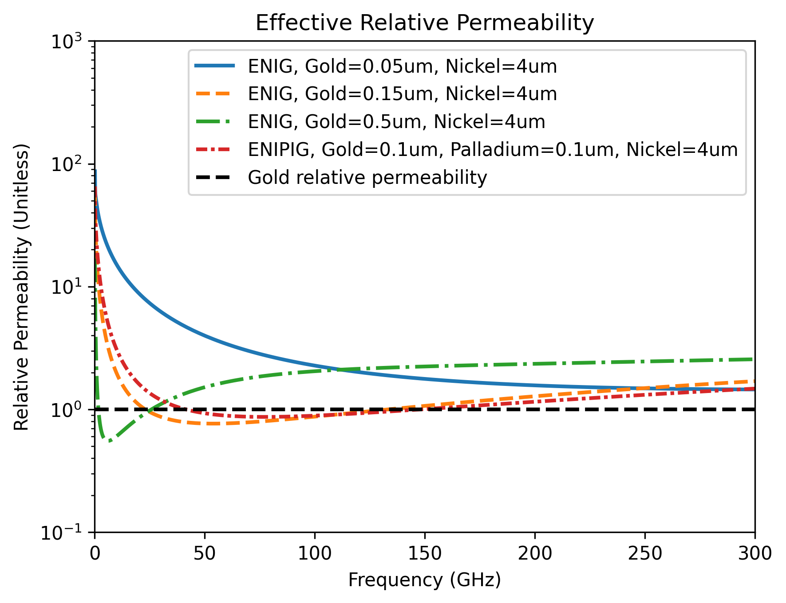
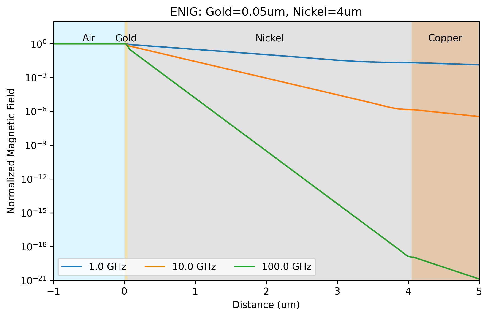
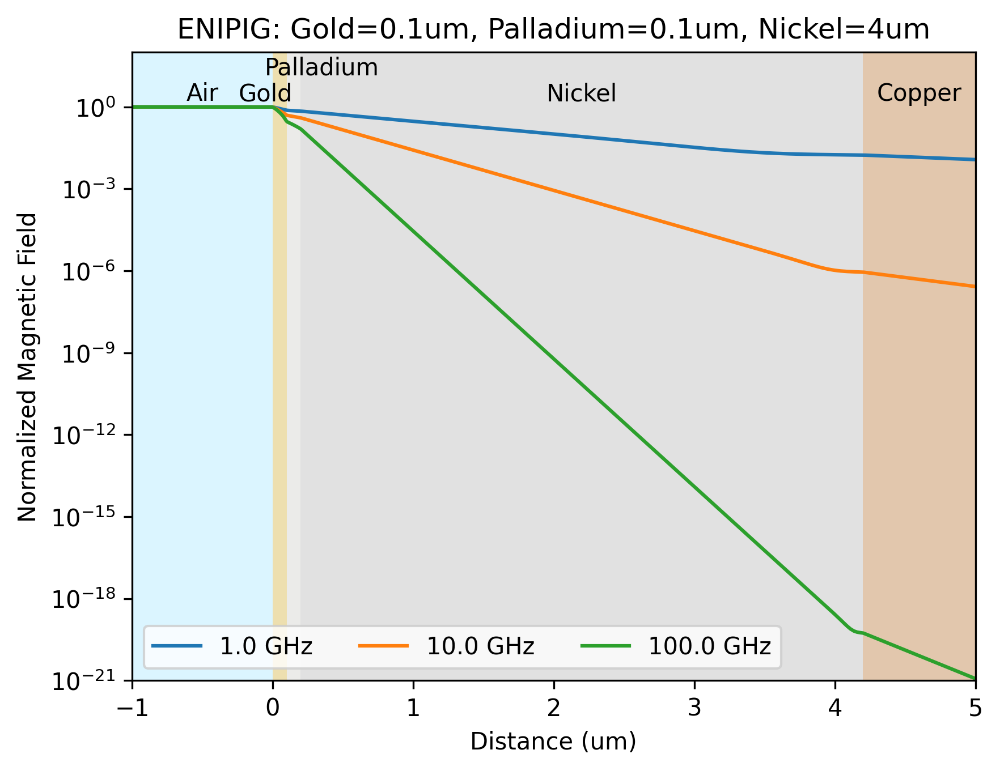

# Surface Impedance

Computing the surface impedance of a rough conductor (or any stack of materials) from its roughness statistics. The result is typically used as a boundary condition in EM simulation or analytical models.

## Implementation

Two scripts are included:

- [`surfz.py`](surfz.py): the transmission line taper method [2], generalized to stacked materials [3]. This is the one to use.
- [`gradmodel.py`](gradmodel.py): the original Gradient Model [1], solved as an ODE. I'm including it only as a reference; it is slow and can be unstable at low roughness values and cannot handle material stacking.

On top of [2], I added a few things:

- Multiple stacked materials [3], where each boundary can have its own roughness level and distribution.
- Permeability and permittivity taper as well, not just conductivity, and everything can be frequency-dependent.
- Any continuous distribution from [scipy.stats](https://docs.scipy.org/doc/scipy/reference/stats.html) (Normal, Rayleigh, Uniform, ...), or your own CDF as a function. Every distribution is shifted and scaled so that its mean is the boundary location and its standard deviation is the RMS roughness.

### How the solver works

The physics is the Gradient Model [1]: roughness smears the sharp interface into a gradual material transition. Each boundary contributes its roughness CDF $F_k(x)$, and the materials blend through it [3]:

$$
\mu(x) = \mu_1 + \sum_k \left(\mu_{k+1} - \mu_k\right) F_k(x), \qquad \varepsilon(x) = \varepsilon_1 + \sum_k \left(\varepsilon_{k+1} - \varepsilon_k\right) F_k(x),
$$

where $\varepsilon = \varepsilon_0\left(\varepsilon_r - j\sigma/(\omega\varepsilon_0)\right)$ carries the conductivity.

The difference to [1] is what is solved for. Instead of integrating an ODE for the magnetic field, which spans many orders of magnitude across the transition, the profile is treated as a cascade of transmission line segments, and the input impedance is transformed from the deepest material up to the surface (Eq. (9) in [2]):

$$
Z_{i} = \eta_i\frac{Z_{i+1} + \eta_i\tanh(\gamma_i \Delta x_i)}{\eta_i + Z_{i+1}\tanh(\gamma_i \Delta x_i)}.
$$

This equation is exact for a uniform segment of any length. So segments are only spent where the material actually changes: a fine mesh over the $\pm 5R_{rms}$ window of each boundary, and a single segment for each uniform bulk layer in between. The material variation inside a segment is handled with a fourth-order Magnus method [5], and the number of segments is doubled until $Z_s$ converges, with Richardson extrapolation [6].

## Installation

No installation, the scripts are standalone. You need [NumPy](https://numpy.org/) and [SciPy](https://scipy.org/), (plus [Matplotlib](https://matplotlib.org/) for the examples):

```bash
python -m pip install numpy scipy matplotlib
```

## How to Use

Copy [`surfz.py`](surfz.py) next to your script and import it. See the examples for more details.

```Python
import numpy as np
import surfz  # should be in the same folder as this script

# frequency grid
f = np.logspace(-1, 2, 100)*1e9

# air over copper, 1 um RMS roughness (materials can be layered and
# frequency-dependent -- see the examples)
material_properties = [{'sigma': 0}, {'sigma': 58e6}]
Zs_rough = surfz.surface_impedance(f, material_properties, Rrms=1e-6, boundary_loc=0, distribution='norm')
```

In most cases you only need the first five arguments; the rest have safe defaults. Pass `return_field=True` if you also want the field through the transition.

The surface impedance is normally fed to an EM simulation as a boundary condition, e.g. <https://github.com/ZiadHatab/hfss-2d-transmission-line-simulation>.

## B-field and Surface Impedance

Comparison between the Gradient Model [1] and the transmission line method [2], see example 1. They agree, as they should. The transmission line method is just much faster, and stays well behaved as the roughness goes to zero.





## Effective Parameters and Probability Distributions

The surface impedance can be rewritten into two real-valued parameters, an effective conductivity and an effective relative permeability:

$$
Z_{s} = \sqrt{\frac{\omega \mu_0}{2\sigma_{eff}}} + j \sqrt{\frac{\omega \mu_0 \mu_{r,eff}}{2\sigma_{0}}}
$$

Keep in mind these are definitions of convenience; they don't always carry the physical meaning that an actual conductivity or permeability would.

The plots below compare roughness distributions at the same $R_{rms}$ (see example 2). Since all distributions are matched to the same mean and standard deviation, what you see is purely the effect of their shape.

 | 
:--: | :--:

## Multiple Conductors

A single surface impedance can describe a whole stack of conductors. In an EM simulation this is valid as long as the stack is thinner than the wavelength, which PCB surface finishes easily satisfy (typically under 5 µm).

A common belief among RF engineers is that ENIG (gold over nickel) is inherently lossy, and that silver is the way to go. Silver is indeed the lowest-loss option, but the story doesn't end there: what really matters is the thickness of the outermost layer, as the measurements in [4] show.

Below, ENIG with different gold thicknesses is compared against ENIPIG (which inserts palladium). Thicker gold pushes the effective conductivity toward gold's own value, and ENIPIG beats ENIG at the typical 0.05 µm gold. The dip in effective conductivity at low frequency is not zero conductivity; it is the nickel's high permeability showing through. Set the nickel $\mu_r$ to 1 in example 3 and it disappears.

 | 
:--: | :--:

And here the magnetic field decaying from air into copper through each coating, at three frequencies (air and copper are treated as semi-infinite). Where the field dies out tells you which layer carries the current.

 | 
:--: | :--:

## References

[1] G. Gold and K. Helmreich, "A Physical Surface Roughness Model and Its Applications," IEEE Transactions on Microwave Theory and Techniques, vol. 65, no. 10, pp. 3720-3732, Oct. 2017, doi: [10.1109/TMTT.2017.2695192](https://doi.org/10.1109/TMTT.2017.2695192).

[2] B. Tegowski, T. Jaschke, A. Sieganschin, and A. F. Jacob, "A Transmission Line Approach for Rough Conductor Surface Impedance Analysis," IEEE Transactions on Microwave Theory and Techniques, vol. 71, no. 2, pp. 471-479, Feb. 2023, doi: [10.1109/TMTT.2022.3206440](https://doi.org/10.1109/TMTT.2022.3206440).

[3] G. Gold and K. Helmreich, "Modeling of transmission lines with multiple coated conductors,"
2016 46th European Microwave Conference (EuMC), London, UK, 2016, pp. 635-638, doi: [10.1109/EuMC.2016.7824423](https://doi.org/10.1109/EuMC.2016.7824423).

[4] B. Schafsteller, M. Schwaemmlein, M. Rosin, G. Ramos, Z. Hatab, M. E. Gadringer, E. Schlaffer, "Investigating the Impact of Final Finishes on the Insertion Loss in As Received and After Aging," IMAPSource Proceedings, vol. 2023, no. Symposium. IMAPS - International Microelectronics Assembly and Packaging Society, Feb. 29, 2024. doi: [10.4071/001c.94519](https://doi.org/10.4071/001c.94519).

[5] S. Blanes, F. Casas, J. A. Oteo, and J. Ros, "The Magnus expansion and some of its applications," Physics Reports, vol. 470, no. 5-6, pp. 151-238, 2009, doi: [10.1016/j.physrep.2008.11.001](https://doi.org/10.1016/j.physrep.2008.11.001).

[6] L. F. Richardson and J. A. Gaunt, "The deferred approach to the limit," Philosophical Transactions of the Royal Society A, vol. 226, pp. 299-361, 1927, doi: [10.1098/rsta.1927.0008](https://doi.org/10.1098/rsta.1927.0008).

## License

[](https://choosealicense.com/licenses/mit/)
