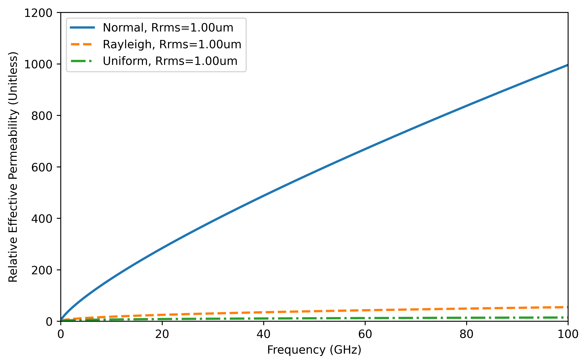

# Surface Impedance

A script for computing the surface impedance of a conductor (or any material, in fact) while taking roughness into account.

## Approaches

Two approaches are implemented:

1. **Gradient Model**: Based on the paper [1]. Note that this approach can be unreliable due to the ODE solver used.
2. **Transmission Line Taper Approach**: Based on the paper [2]. I generalized this approach to allow tapering of any or all material properties.

**Recommendation**: Use method [2]. It is more reliable, faster, versatile, and can handle any CDF curves.

## Probability Distributions

Different probability distributions for roughness are included:

- Normal
- Rayleigh
- Uniform

You can add more distributions by modifying the CDF function. Note that the Gradient Model [1] may face issues with different CDFs; therefore, method [2] is recommended for all cases.

In the implementation of method [2], you can also taper permittivity and permeability based on the selected CDF. Additionally, multimodal CDFs can be used if defined in the CDF function.

**Notes**:

- The ODE solver for the Gradient Model [1] can be unstable, especially for low roughness values, and is generally slow. use method [2] instead.
- In method [1], the bulk conductivity can be frequency-dependent, whereas in method [2], all parameters can be frequency-dependent.

## Installation

You need the following libraries:

- [Scipy](https://scipy.org/) for ODE and CDF/PDF computation
- [Numpy](https://numpy.org/) for numerical operations
- [Matplotlib](https://matplotlib.org/) for plotting

## Example Plots

### B-field Intensity

Example plots for the B-field based on method [1]:

### Surface Impedance

Comparison between the Gradient Model [1] and Transmission Line Approach [2] for calculating the surface impedance:

## Effective Parameters

The surface impedance is rewritten into real-valued parameters: effective conductivity and relative effective permeability, based on the equation:

$$
Z_{s} = \sqrt{\frac{\omega \mu_0}{2\sigma_{eff}}} + j \sqrt{\frac{\omega \mu_0 \mu_{r,eff}}{2\sigma_{0}}}
$$

Effective conductivity and permeability plots:

 | 
:--: | :--:

Comparison between different probability distributions for roughness:

 | 
:--: | :--:

## References

[1] G. Gold and K. Helmreich, "A Physical Surface Roughness Model and Its Applications," IEEE Transactions on Microwave Theory and Techniques, vol. 65, no. 10, pp. 3720-3732, Oct. 2017, doi: [10.1109/TMTT.2017.2695192](https://doi.org/10.1109/TMTT.2017.2695192).

[2] B. Tegowski, T. Jaschke, A. Sieganschin, and A. F. Jacob, "A Transmission Line Approach for Rough Conductor Surface Impedance Analysis," IEEE Transactions on Microwave Theory and Techniques, vol. 71, no. 2, pp. 471-479, Feb. 2023, doi: [10.1109/TMTT.2022.3206440](https://doi.org/10.1109/TMTT.2022.3206440).

## License

